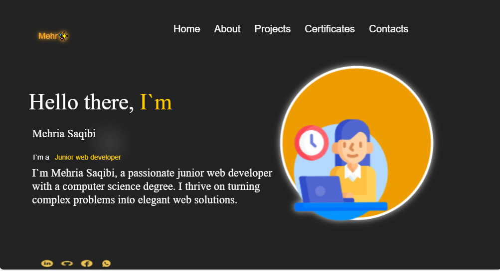

# Portfolio Capstone 🚀

## Project Description 📝
This capstone portfolio project represents the culmination of my skills in front-end web development using HTML, CSS, and JavaScript. It serves as a comprehensive showcase of my professional profile, projects, and technical abilities.and It includes a responsive design with interactive elements to highlight my professional profile, projects, and achievements.
> And Also with the help of my UI/UX Designer its completed the design 


## Demo 📸



<br>
 [Live-link](  https://saqibi4213.github.io/portfolio-capstone/)


## Technologies Used 🛠️

- HTML
- CSS
- JavaScript

## Installation 💻


Folow these steps to set up the project on your local machine 
Ensure you have the following software installed on your machine

```bash
#git clone
```
```bash
#git@github.com:Saqibi4213/portfolio-capstone.git
```

## Usage 🎯


you can access to my project through git clone 
-git clone the HTTP or My SSH code link from the repository you what to clone 

```bash
#git clone
```

## Features ⭐

- Responsive Design: Ensures optimal viewing experience across various devices and screen sizes.
- Interactive Elements: Enhances user engagement through interactive navigation and project displays.
- Project Showcase: Highlights a curated selection of my best work with detailed descriptions and links to live demos or GitHub repositories. 
- Skills Section: Provides an overview of my technical skills and expertise.
- Contact Information: Includes ways to reach out to me for collaborations, inquiries, or networking opportunities.

## Author 👩‍💻
- Website: [website.com]( )
- LinkedIn: [Mehria saqibi](https://www.linkedin.com/in/mehria-saqibi-a386a41a1?utm_source=share&utm_campaign=share_via&utm_content=profile&utm_medium=android_app)
- Email: [email](mosawermh@gmail.com)

### UI/UX Author 👩‍💻 
- Name: Sumaya Farahmand
- LinkedIn: [Sumaya farahmand](https://www.linkedin.com/in/maryam-tarakhail-098a992a8?utm_source=share&utm_campaign=share_via&utm_content=profile&utm_medium=android_app)
- Email: [email]( s.frahmand2003@gmail.com)
<br>
- Name: Maryam Tarakhail
- LinkedIn: [Maryam Trakhail](https://www.linkedin.com/in/maryam-tarakhail-098a992a8?utm_source=share&utm_campaign=share_via&utm_content=profile&utm_medium=android_app)
- Email: [email]( Maryamtarakhail2021@gmail.com)
<br>
- Name: 
- LinkedIn: [Sumaya farahmand]()
- Email: [email]()


## Contributing 🤝

Contributions are welcome! If you'd like to contribute, please fork the repository and create a pull request. Ensure that your code follows the project's coding standards and guidelines.
